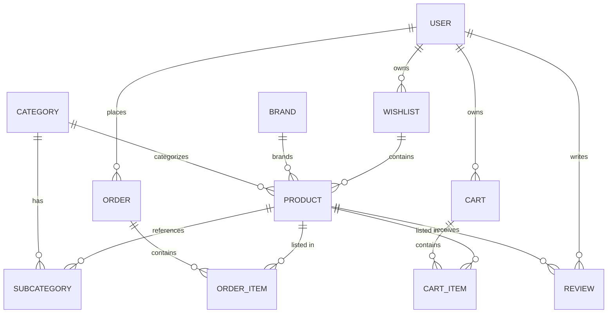

# On — Sportswear eCommerce Frontend

**On** is a sportswear eCommerce single-page application built with **React 19**, **TypeScript**, and **Vite 8** (Rolldown-based). It uses a feature-based architecture, server-state caching via TanStack Query, full English/Arabic internationalization with RTL support, and a brutalist athletic design system (zero-radius corners, high-contrast palettes, bold condensed typography).

The app is a **client-only frontend**. All commerce data (products, cart, orders, authentication) comes from the external **Route MIS eCommerce REST API** (`https://ecommerce.routemisr.com/api/v1/`, configurable via `VITE_API_URL`).

---

## Overview

| | |
|---|---|
| **What it is** | An eCommerce storefront for sportswear/apparel (catalog, cart, checkout, orders, account) |
| **Main purpose** | Let visitors browse products, manage a cart/wishlist, place orders, and manage their profile |
| **Target users** | End customers shopping the catalog; no admin or merchant flows exist in the UI |
| **Main workflow** | Browse products → filter/search → product details → add to cart/wishlist → checkout (cash on delivery or online payment via redirect) → track orders → manage profile |
| **Current scope** | Frontend only. The backend is a third-party REST API; several marketing/legal pages and some form flows are static UI without API wiring |

---

## Features

### Authentication & Authorization

- **Email/password login and registration** against `POST /api/v1/auth/signin` and `/signup` (register also sends `rePassword`).
- **Token-based session** stored in `localStorage` (`token`, `userId`).
- **Google OAuth one-tap sign-in** via `@react-oauth/google`; the credential JWT is decoded client-side with `jwt-decode`. Google sessions are simulated locally (`token = "google_oauth"`, `userId = decoded.sub`, full payload in `user_info`); there is no server-side Google token verification.
- **Route protection** — cart, checkout, orders, profile and wishlist pages redirect to `/login` when no token exists.
- **Logout** — remove `token`/`userId` (profile logout additionally removes `user_info`) and reload.
- **Static password-recovery pages** — `/forgot-password` and `/reset-password` render forms **without any API integration**.

### Product Catalog

- **Server-paginated listing** (`/products`) with query-parameter filters: category, brand, price range, sort, and keyword.
- **Filter UI** — sticky desktop filter panel (checkboxes, price range, sort dropdown) plus a mobile bottom filter sheet.
- **Numbered pagination** with ellipsis (first/last/current±1 pages).
- **Product detail page** (`/products/:slug/:id`) with image gallery + lightbox, ratings, review list, stock status, price/discount display, quantity stepper, add-to-cart/wishlist actions, and static Q&A/review-submission sections (display only).
- **Quick-view dialog** on product cards.

### Categories & Brands

- Dedicated listing pages (`/categories`, `/brands`) and detail pages (`/categories/:slug/:id`, `/brands/:slug/:id`) driven by the API.

### Cart

- Full CRUD: add item, update quantity, remove item, clear cart (with confirmation toast).
- Responsive item cards and a summary view (subtotal → checkout).
- Navbar **mini-cart sheet** (Radix Sheet) with item list, subtotal, and quick checkout link.

### Checkout

- Shipping-address form (phone, city, street details) validated with React Hook Form.
- **Cash on delivery** — `POST /orders/:cartId`, then redirect to `/orders`.
- **Online payment** — creates a checkout session and redirects to the gateway's `session.url`.

### Wishlist

- Add / remove products; navbar mini-wishlist sheet with count badge; dedicated `/wishlist` page with move-to-cart.

### Orders

- Order history for the logged-in user (`GET /orders/user/:userId`, `userId` decoded from JWT when missing).
- Status badges (paid/delivered) and payment method display; navbar mini-orders sheet.

### Profile

- View profile (name, email, phone) fetched from `GET /users/getMe`.
- Edit profile via a sheet (`PUT /users/updateMe`).
- Google sign-in users are shown profile data from the `user_info` localStorage payload.

### Search & Navigation

- **Navbar search dropdown** filters all products in-memory by title, with keyboard navigation (arrows/Enter/Escape) and image results.
- Submitting a query navigates to `/products?q=...` (note: the products page currently ignores the `q` parameter — see [Limitations](#limitations)).
- **Navbar mini sheets** for cart, wishlist, and orders are mutually exclusive (opening one closes the others), with a blur overlay.

### Store Locator

- **Branches page** (`/branches`) with interactive world map (React Simple Maps) and marker/card cross-navigation. Branch data is **hard-coded** in `src/features/branches/data/branches.ts` (10 fictional branches) — not fetched from the API.

### Guided Tour

- Route-aware product tours powered by **driver.js** for 11 routes: home, products, product-details, cart, wishlist, profile, orders, checkout, about, contact, help.
- Completion state is persisted in `localStorage` (`on_app_tours_completed`); a tour-reset button allows re-running them.

### Marketing & Static Pages

- Home page with hero (video background), campaign sections, featured/trending products, categories, brands, testimonials, values, team and blog sections (largely **static/mock content** under `src/features/home/utils/`).
- Footer/legal/help pages: about, contact, faq, help, privacy, terms, policies, shipping, returns, size guide, support-policy, store-location.
- **Features showcase page** (`/features`) linking to all major sections.
- Footer newsletter and app-store badges are **static UI** (no submission logic).

### Platform / PWA

- Installable PWA via `vite-plugin-pwa` (web manifest, `start_url: /en`, auto-updating service worker with Workbox precaching).
- **i18n**: English and Arabic (~1,175 translation keys per language) with RTL layout, locale-prefixed URLs (`/en`, `/ar`), and `<html>` direction/language sync.
- Light/dark/system theme with a View-Transitions-based circular theme switch.

---

## User Roles

There is **no role-based access control** in the implementation. The `role` field is present in API user payloads (`AuthUser.role`, `User.role`) and the profile page renders a default `"user"` role, but the frontend never gates functionality on it.

| Role (from API) | What the frontend does |
| --- | --- |
| Any authenticated user | Full storefront access: cart, checkout, wishlist, orders, profile. No admin/merchant screens or permissions exist. |
| Unauthenticated visitor | Browse products, categories, brands, static pages; limited navbar (sign in / create account). Cart-adjacent data hooks are disabled without a token (`enabled: !!user`), so cart/wishlist/orders APIs are not called. |

---

## Application Architecture

The application is a classic **React SPA consuming a third-party REST API**. Its architecture can be summarized as:

```
Browser
  │
  ├── src/ (feature-based frontend)
  │     ├── app/            → providers, lazy page re-exports, route table
  │     ├── components/     → layout (Navbar, Hero) + shared UI + shadcn/ui primitives
  │     ├── features/*/     → self-contained modules (api + hooks + components + pages + types)
  │     ├── shared/         → cross-cutting components, providers, types, layout (Footer)
  │     ├── lib/            → axios instance, localization path helpers, cn()
  │     ├── i18n/           → i18next config
  │     └── locales/        → en / ar translation.json
  │
  └── External API (Route MIS eCommerce) → MongoDB-backed REST endpoints + payments gateway
```

### Design patterns

- **Feature-based / module convention** — each feature owns its `api/`, `components/`, `hooks/`, `pages/`, `types/` (and `schemas/`, `utils/` where needed). Cross-feature reuse goes through `shared/` and `components/`.
- **Container / Presentational** — data-driven pages (`*Page.tsx`) handle fetching + handlers and render a pure `*View.tsx` component.
- **Lazy loading everywhere** — pages use `React.lazy()` with a per-page `PageLoader`; homepage sections use `LazyLoad`/`LazySection` triggered by an IntersectionObserver; the whole routes module is lazily imported.
- **Server-state hooks** — each API function is a standalone async module wrapped in feature-owned `useQuery`/`useMutation` hooks; mutations invalidate shared query keys (`["cart"]`, `["wishlist"]`, `["orders"]`).

### Component hierarchy

```
<StrictMode>
  <GoogleOAuthProvider clientId={VITE_GOOGLE_CLIENT_ID}>
    <AppProviders>                 # QueryClient, i18n, Helmet, Theme + SpeedInsights, devtools (dev)
      <BrowserRouter>
        <LenisProvider>            # ReactLenis smooth scroll, reduced-motion aware
          <TourProvider>           # driver.js guided tours
            <App>
              <MotionCursor />
              <Toaster />          # react-hot-toast
              <Navbar />           # Ticker, logo, language switcher, search, actions, mini sheets
              <main>
                <Suspense fallback={<Skeleton />}>
                  <AppRoutes />    # lazy 32 pages under /:lang
              <Footer />
              <ScrollToTopButton />
```

---

## Project Structure

```
on/
├── public/                     # Static assets: fonts, icons, favicon, robots.txt
├── src/
│   ├── app/
│   │   ├── pages/              # Lazy page re-exports (one folder per route, 32 pages)
│   │   ├── providers/          # AppProviders (QueryClient, i18n, Helmet, Theme, Devtools)
│   │   └── routes/             # Lazy-loaded route table under /:lang (LangLayout)
│   ├── assets/                 # Bundled images + hero video (hero-bg.mp4)
│   ├── components/
│   │   ├── layout/             # Navbar (Ticker, search, mini sheets, user menu, mobile nav) + Hero
│   │   ├── shared/             # CardImage, ScrollReveal, Slider, Pagination, Loaders, EmptyState,
│   │   │                       # Error, MotionCursor, ThemeToggle(s), LanguageSwitcher, filters/, logo/
│   │   └── ui/                 # shadcn/ui primitives (button, card, input, sheet, dialog, ...)
│   ├── features/               # 18 feature modules, each with api/ components/ hooks/ pages/ types/
│   │   ├── auth cart checkout orders wishlist profile
│   │   ├── products product-details categories category-details brands brand-details
│   │   ├── home platform branches tour footer-pages not-found
│   ├── hooks/                  # use-intersection-observer
│   ├── i18n/                   # i18next init, language detection, RTL direction sync
│   ├── lib/                    # axios instance, cn(), localized-path helpers
│   ├── locales/                # en & ar translation.json (~1,175 keys each)
│   └── shared/                 # PageHelmet, LazyLoad/LazySection, Footer, Theme/Lenis providers,
│                               # LenisScroll context, ApiResponse/MongoDoc types
├── components.json             # shadcn/ui config (style: base-nova)
├── DESIGN-SYSTEM.md            # Design system spec (MCPDS)
├── index.html                  # Vite entry, fonts, meta
├── eslint.config.js            # Flat ESLint config
├── package.json
├── tsconfig*.json              # Project-references TS config (app + node)
├── vercel.json                 # SPA rewrite for Vercel
└── vite.config.ts              # Tailwind, React, PWA plugin, manual vendor chunks, @ alias
```

### Note on the feature module convention

```
feature/
├── api/            # Standalone Axios functions (e.g. GetAllProducts.ts)
├── components/     # Feature-specific views/components (+ skeletons)
├── hooks/          # useQuery / useMutation wrappers
├── pages/          # Page components consumed by the router
├── types/          # TypeScript interfaces for the API payloads
└── (schemas/, utils/, data/ where applicable)
```

---

## Technology Stack

| Technology | Purpose |
| --- | --- |
| React 19 + React DOM | UI framework |
| TypeScript 6 | Typed JavaScript for the whole codebase |
| Vite 8 (`@vitejs/plugin-react`, `@rolldown/plugin-babel`) | Build tool & dev server; Rolldown bundling, esbuild minify, manual vendor chunks |
| React Router 7 | Client routing (all routes nested under `/:lang`) |
| TanStack React Query 5 (+ devtools) | Server-state fetching, caching, and invalidation |
| Axios 1 | HTTP client (base URL, auth-token request interceptor, 401 response interceptor) |
| Tailwind CSS 4 (`@tailwindcss/vite`) | Styling (CSS-first config, oklch design tokens, `tw-animate-css`) |
| shadcn/ui (`base-nova` style) | UI primitives generated from component.json (on Base UI + `@radix-ui/react-dialog`) |
| class-variance-authority / clsx / tailwind-merge | Variant + class merging (`cn()`) |
| lucide-react | Icon set |
| Framer Motion 12 + motion 12 | Animations (scroll reveal, cursor, theme transitions, map markers) |
| Swiper 12 | Carousels / product sliders |
| Lenis | Smooth scrolling (reduced-motion aware) |
| React Hook Form 7 | Form state + validation |
| i18next 26 / react-i18next 17 / i18next-browser-languagedetector | EN/AR internationalization with RTL |
| react-helmet-async | Per-page SEO via `PageHelmet` (title/description) |
| react-hot-toast | Toast notifications |
| @react-oauth/google + jwt-decode | Google OAuth one-tap sign-in |
| yet-another-react-lightbox | Product image lightbox |
| react-simple-maps 3 | Branch store-locator map |
| driver.js | Guided product tours |
| vite-plugin-pwa | Web app manifest + auto-updating service worker |
| @vercel/speed-insights | Vercel speed analytics |
| @fontsource-variable/oswald | Self-hosted heading font; Inter + Cairo from Google Fonts |
| ESLint 10 + typescript-eslint + react-hooks + react-refresh | Linting |

> `babel-plugin-react-compiler` is listed in `devDependencies` but is **not configured** in `vite.config.ts`.

---

## Backend

There is **no backend code in this repository**. The application is a client-only SPA that talks to the external **Route MIS eCommerce REST API**:

- **Base URL**: `import.meta.env.VITE_API_URL` → default `http://localhost:3000/api`. The `.env` file in the working tree (gitignored, not committed) sets `VITE_API_URL=https://ecommerce.routemisr.com`, so all calls hit `/api/v1/...` paths.
- **Auth token**: Axios request interceptor reads `localStorage["token"]` and sets it as the **`token` request header** (not `Authorization: Bearer`).
- **401 handling**: the response interceptor removes `token` + `userId` on any 401.

All response shapes consumed by the app are typed in the `types/` folders of each feature.

---

## API

Base: `${VITE_API_URL}/api/v1` · Authenticated requests carry the `token` header.

### Auth
| Method | Endpoint | Purpose | Access |
| --- | --- | --- | --- |
| POST | `/auth/signin` | Login with email/password | Public |
| POST | `/auth/signup` | Register (name, email, phone, password, rePassword) | Public |

### Catalog
| Method | Endpoint | Purpose | Access |
| --- | --- | --- | --- |
| GET | `/products` | Paginated products list. Params: `page`, `limit`, `sort`, `keyword`, `price[gte]`, `price[lte]`, `category[in]`, `brand[in]` | Public |
| GET | `/products/:id` | Product details | Public |
| GET | `/categories` | Categories list (params: `page`, `limit`, `sort`, `keyword`) | Public |
| GET | `/categories/:id` | Category details | Public |
| GET | `/brands?page=` | Brands list | Public |
| GET | `/brands/:id` | Brand details | Public |

### Cart
| Method | Endpoint | Purpose | Access |
| --- | --- | --- | --- |
| GET | `/cart` | Get the user's cart | Authenticated |
| POST | `/cart` | Add product (`{ productId }`) | Authenticated |
| PUT | `/cart/:itemId` | Update item count (`{ count }`) | Authenticated |
| DELETE | `/cart/:itemId` | Remove one item | Authenticated |
| DELETE | `/cart` | Clear the whole cart | Authenticated |

### Wishlist
| Method | Endpoint | Purpose | Access |
| --- | --- | --- | --- |
| GET | `/wishlist` | Get wishlist | Authenticated |
| POST | `/wishlist` | Add product (`{ productId }`) | Authenticated |
| DELETE | `/wishlist/:productId` | Remove product | Authenticated |

### Orders & Checkout
| Method | Endpoint | Purpose | Access |
| --- | --- | --- | --- |
| GET | `/orders/user/:userId` | Order history | Authenticated |
| POST | `/orders/:cartId` | Create order (cash on delivery) with `{ shippingAddress }` | Authenticated |
| GET | `/orders/checkout-session/:cartId?url=...` | Online payment session; app redirects to `session.url` | Authenticated |

### Profile
| Method | Endpoint | Purpose | Access |
| --- | --- | --- | --- |
| GET | `/users/getMe` | Current user profile | Authenticated |
| PUT | `/users/updateMe` | Update profile (`{ name?, email?, phone? }`) | Authenticated |

### Data-fetching pattern

```typescript
// api
export const getAllProducts = (filters: ProductFilters): Promise<ApiResponse<Product>> =>
  api.get("/products", { params: filters }).then((res) => res.data);

// hook
export const useAllProducts = (filters: ProductFilters) =>
  useQuery({
    queryKey: ["products", "all", filters],
    queryFn: () => getAllProducts(filters),
    staleTime: 1_000 * 60 * 2,
  });
```

---

## Database

The app has **no local database**. Data lives in a MongoDB-backed external API. The schemas below are the response shapes defined in the frontend `types/` modules.

### Main models

| Model | Key fields |
| --- | --- |
| `Product` | `title`, `slug`, `description`, `quantity`, `price`, `priceAfterDiscount`, `imageCover`, `images[]`, `category`, `brand`, `subcategory[]`, `ratingsAverage`, `ratingsQuantity`, `sold`, `reviews[]` |
| `Category` | `name`, `slug`, `image` |
| `Brand` | `name`, `slug`, `image` |
| `Subcategory` | `name`, `slug`, `category` |
| `Review` | `rating`, `review`, `user {_id, name}`, `createdAt`, `updatedAt` |
| `Cart` | `cartOwner`, `products[{ product, count, price }]`, `totalCartPrice` |
| `Wishlist` | `data: Product[]`, `count` |
| `Order` | `user`, `cartItems[]`, `totalOrderPrice`, `taxPrice`, `shippingPrice`, `shippingAddress {details, phone, city}`, `paymentMethodType`, `isPaid`, `isDelivered`, `paidAt`, `deliveredAt` |
| `User` | `name`, `email`, `phone`, `picture`, `role`, `active` |

### Relationship map (from the frontend types)



> `MongoDoc` (shared type) defines the `_id` + `id` pair assumed on every document.

---

## Frontend

### Routing

- **React Router 7**, all routes nested under a `/:lang` layout (`LangLayout`) that calls `i18n.changeLanguage(lang)`.
- **32 pages** are `React.lazy()`-loaded; per-page Suspense fallback is `PageLoader`, and the routes module has a full-screen `Skeleton` fallback.
- **Default redirect**: `/` → `/en`.

### Route map (all under `/:lang`)

| Route | Page |
| --- | --- |
| `/` (index), `/home` | HomePage |
| `/auth` → redirects to `/login`; `/login`, `/register` | Login / Register |
| `/forgot-password`, `/reset-password` | Static password-recovery forms |
| `/products` | ProductsPage (listing + filters) |
| `/products/:slug/:id` | ProductDetailsPage |
| `/categories`, `/categories/:slug/:id` | Categories / CategoryDetails |
| `/brands`, `/brands/:slug/:id` | Brands / BrandDetails |
| `/cart`, `/checkout`, `/orders`, `/profile`, `/wishlist` | Commerce / account pages |
| `/about`, `/contact`, `/privacy`, `/terms`, `/faq`, `/shipping`, `/returns`, `/size-guide`, `/help`, `/support-policy`, `/policies`, `/store-location` | Footer/static pages |
| `/features` | Features showcase |
| `/branches` | Store locator (map) |
| `*` | NotFoundPage (404) |

### State management

| Concern | Tool |
| --- | --- |
| Server state | TanStack Query 5 — global defaults `staleTime: 5 min`, `retry: 1`; features override (products/cart/orders/wishlist/details = 2 min, profile = 10 min) |
| Form state | React Hook Form 7 (auth, checkout, profile edit) |
| Theme | React Context (`ThemeProvider`) + `localStorage["vite-ui-theme"]` |
| Guided tours | React Context (`TourProvider`) + `localStorage["on_app_tours_completed"]` |
| Scroll | React Context (`LenisScrollContext`) exposing `scrollToTop` / `scrollTo` |
| Auth session | `localStorage` (`token`, `userId`, `user_info`) read by the Axios interceptor |

### Data fetching

- Standalone Axios functions → feature `useQuery`/`useMutation` hooks → invalidate related queries on mutation success.
- Data hooks for cart/wishlist/orders are **enabled only when a token exists** (`enabled: !!user`).
- The navbar (`useNavbar`) subscribes to cart, wishlist, and orders queries to power the badge counts and mini sheets.

### Forms & validation

- Login/register/checkout use React Hook Form rules: email pattern, password `minLength: 6`, Egyptian phone format `^01[0-9]{9}$`, confirm-password match (register).
- Localized validation messages from `translation.json`.

### Error handling

- Query errors surface via shared `ErrorState`/`EmptyState` components with localized fallback messages and a "retry" action.
- Mutation errors surface through `react-hot-toast` (`err.message` or API `data.message`).
- Axios 401 response clears the session (`token`/`userId`).

### UX highlights

- Sticky navbar with news **ticker**, language switcher, in-memory search dropdown, and right-hand mini sheets for cart/wishlist/orders (mutually exclusive).
- **Lenis smooth scroll** with scroll-to-top button; disabled under `prefers-reduced-motion`.
- IntersectionObserver-based **lazy section mounting** on the home page.
- `CardImage` shared component: lazy images, skeleton shimmer, error fallback.
- Per-feature skeleton loaders (home sections, products, cart, checkout, branches, profile, auth).
- Circular View-Transitions **theme toggle** + standard toggle.

---

## Authentication & Security

Mechanisms that actually exist in the code:

- **Token-based auth** — JWT/session token stored in `localStorage` and attached to every request via the `token` header using an Axios request interceptor (`src/lib/axios.ts`).
- **401 session cleanup** — Axios response interceptor removes `token`/`userId` on HTTP 401.
- **Client-side route guarding** — cart, checkout, orders, profile and wishlist redirect unauthenticated users to `/login`.
- **Google OAuth** — one-tap sign-in; the ID-token JWT is decoded client-side (not verified against Google servers by this app).
- **Client-side form validation** — email/phone/password rules on login, register and checkout (localized).
- **Reactive-safe defaults** — data hooks for protected endpoints are disabled without a token.

Not present (server/third-party concerns, not implemented in this repo): password hashing (handled by the API), role-based authorization, rate limiting, CORS policy, security headers, input sanitization beyond framework defaults, refresh-token handling.

### localStorage keys

| Key | Purpose |
| --- | --- |
| `token` | Session JWT (or `"google_oauth"` for Google sign-in) |
| `userId` | User `_id` (Google: decoded `sub`) |
| `user_info` | Google JWT payload, JSON-stringified |
| `i18nextLng` | Cached language for the i18n detector |
| `vite-ui-theme` | Theme preference (`light` / `dark` / `system`) |
| `on_app_tours_completed` | JSON array of completed guided-tour IDs |

---

## Environment Variables

There is no committed `.env.example` (the `.env` file is gitignored). Expected variables:

```env
VITE_API_URL=https://ecommerce.routemisr.com
VITE_GOOGLE_CLIENT_ID=your-google-oauth-client-id.apps.googleusercontent.com
```

| Variable | Required | Purpose |
| --- | --- | --- |
| `VITE_API_URL` | Yes (for prod) | Base URL of the REST API (the axios default is `http://localhost:3000/api`) |
| `VITE_GOOGLE_CLIENT_ID` | For Google login | Client ID passed to `GoogleOAuthProvider` |

---

## Installation

Requirements: **Node `^20.19.0` or `>=22.12.0`** (Vite 8 engine requirement) and npm.

```bash
# 1. Clone the repository
git clone <repo-url>
cd on

# 2. Install dependencies
npm install

# 3. Configure environment variables
#    Create a .env file in the project root:
#      VITE_API_URL=https://ecommerce.routemisr.com
#      VITE_GOOGLE_CLIENT_ID=your-google-oauth-client-id.apps.googleusercontent.com

# 4. Run the development server (default: http://localhost:5173)
npm run dev

# 5. Type-check + production build
npm run build
```

> No local database or backing services are needed — everything reads the external API.

---

## Available Scripts

| Script | Command | Description |
| --- | --- | --- |
| `dev` | `vite` | Start the dev server with HMR |
| `build` | `tsc -b && vite build` | Type-check via project references, then production build (Rolldown) with PWA assets |
| `lint` | `eslint .` | Flat-config ESLint over the codebase |
| `preview` | `vite preview` | Serve the production build locally |

---

## Testing

**No test suite exists.** There are no unit, integration, or e2e tests and no coverage configuration in the repository. Dependencies are not set up for `vitest`/`jest`/`cypress`/`playwright`.

---

## Deployment

- Configured for **Vercel**: `vercel.json` applies a catch-all SPA rewrite (`/(.*)` → `/index.html`). Vercel auto-detects `npm run build` and serves `dist/`.
- `public/robots.txt` references `https://on-app.vercel.app/sitemap.xml` (the sitemap itself is not present in the repo).
- PWA artifacts (manifest, service worker, Workbox runtime) are generated into `dist` by `vite-plugin-pwa`.
- `@vercel/speed-insights` is wired into the app providers.

---

## Current Project Status

**Fully implemented**

- Catalog browsing with server pagination + filters; product detail page (gallery, ratings, reviews display, stock, quick view).
- Categories/brands listing and detail pages.
- Cart CRUD + navbar mini-cart; wishlist add/remove + navbar mini-wishlist; orders history + navbar mini-orders.
- Checkout with COD and online-payment redirect.
- Login/register (email + Google) with token sessions, protected pages, logout.
- Profile view/edit; Google profile fallback.
- Search dropdown (in-memory) + navigation to `/products?q=`.
- Branches store-locator map.
- Guided tours (11 routes) with persisted completion.
- Full EN/AR i18n with RTL; light/dark/system theming; PWA; Vercel deployment config.

**Partially implemented / static UI**

- `forgot-password` / `reset-password` — forms only, no API calls.
- Product review submission (`AddReview`) — star/text UI only, no submit logic.
- Product Q&A — static Q&A list; the "ask" input does not submit.
- Home page content (blog, team, testimonials, values, features, brand story) — hard-coded mock data.
- Footer newsletter signup and app-store badges — visual only.
- Branches — hard-coded data (not API-driven).
- Search `?q=` navigation — the `ProductsPage` does not read the `q` query parameter.

**Not implemented**

- Role-based authorization / admin or merchant dashboards.
- Server-side verification of Google tokens.
- Automated tests and CI/CD pipelines.
- A committed `.env.example`.

---

## Limitations

- `tsconfig.app.json` / `tsconfig.node.json` do **not** enable TypeScript `strict` mode (they rely on `noUnusedLocals`, `noUnusedParameters`, `noFallthroughCasesInSwitch`, `verbatimModuleSyntax`).
- `babel-plugin-react-compiler` is installed but not wired into `vite.config.ts`.
- Logout is inconsistent: navbar logout and the Axios 401 handler do not remove `user_info` (Google profile data) — only the profile-page logout does.
- Search results are an in-memory filter over the (default page of) all products; the products page ignores the `q` URL parameter it is navigated to.
- Google sign-in is a client-side simulation (no backend user creation, token not exchanged server-side).
- Several commerce features are display-only or static (reviews, Q&A, newsletter, password recovery).
- No error-boundary / crash-screen handling; errors surface via query state + toasts only.

---

## Future Improvements

Future improvements (not yet implemented):

- Wire the `q` search parameter into the products listing (server-side keyword filtering is already supported by the API).
- Implement forgot/reset password flows against the API.
- Add real submit logic for product reviews and Q&A.
- Store branches in the API and fetch them instead of using hard-coded data.
- Enable TypeScript `strict` mode.
- Add a test runner and coverage configuration.
- Add a `.env.example`, unify the logout path, and centralize route guards into a single `ProtectedRoute` wrapper.

---

## Development Notes

- **Component conventions**: `memo()`-wrapped presentational components, `useCallback` for handlers, `useMemo` for derived values (122 `memo()`, 79 `useCallback`, 18 `useMemo` call sites), feature-level skeletons adjacent to their views.
- **Design system**: `DESIGN-SYSTEM.md` (MCPDS) is the single source of truth; all colors are oklch CSS variables defined in `src/index.css` with `--radius: 0`. Arabic overrides reduce heavy font weights and switch fonts to Cairo.
- **Adding a route**: create a folder under `src/app/pages/<Page>/` that re-exports the feature's page, then add a `lazy()` import + `<Route>` in `src/app/routes/index.tsx`. Translations go under `src/locales/{en,ar}/translation.json`.
- **Manual vendor chunking** is configured in `vite.config.ts` (`vendor-react`, `vendor-react-dom`, `vendor-router`, `vendor-query`, `vendor-motion`, `vendor-swiper`, `vendor`).
- **Linting**: run `npm run lint` (ESLint flat config with react-hooks + react-refresh).
- **Type-check + build**: `npm run build` runs `tsc -b` then Vite; the build targets `esnext` with esbuild minification.

---

## Conclusion

**On** is a polished, feature-based eCommerce frontend for sportswear, implemented as a React 19 + TypeScript + Vite SPA that consumes a third-party REST API. It delivers a complete customer journey — browse, filter, search, product details, cart, wishlist, checkout (COD + online), order history, and profile — wrapped in a distinct brutalist design system with full English/Arabic (RTL) support, PWA installability, guided tours, and rich loading/animation polish.

The application is well-structured and largely functional on the storefront, but it remains a **frontend-only implementation**: several support flows (password recovery, reviews/Q&A, newsletter, branch data) are static or hard-coded, there is no role-based administration, no automated tests, and no committed environment example. These boundaries are documented above so the project can be extended without assuming features that do not exist yet.